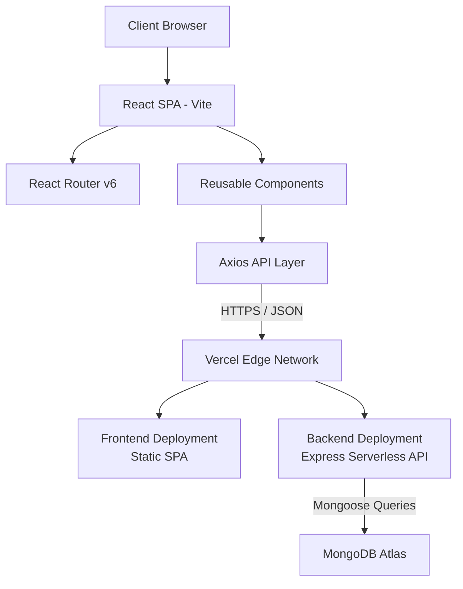
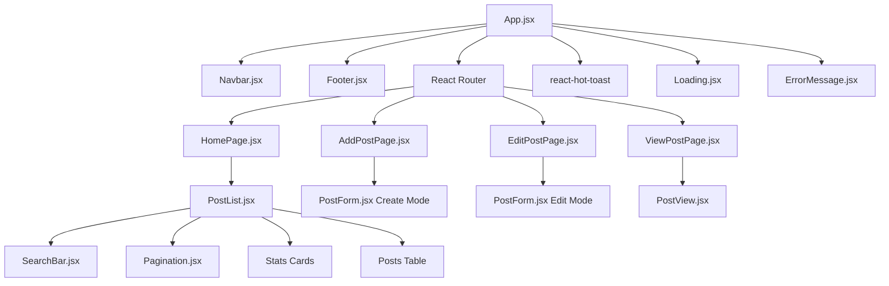
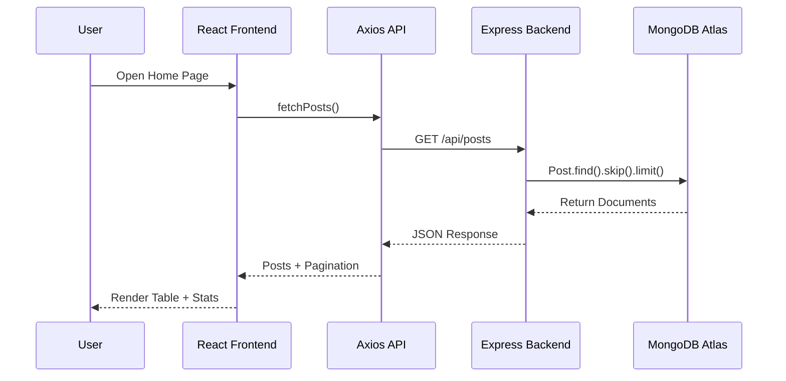
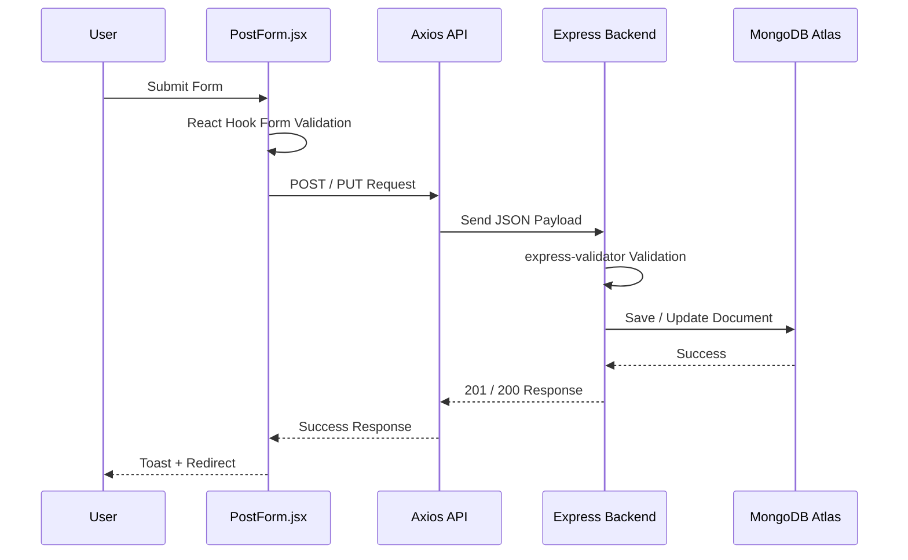
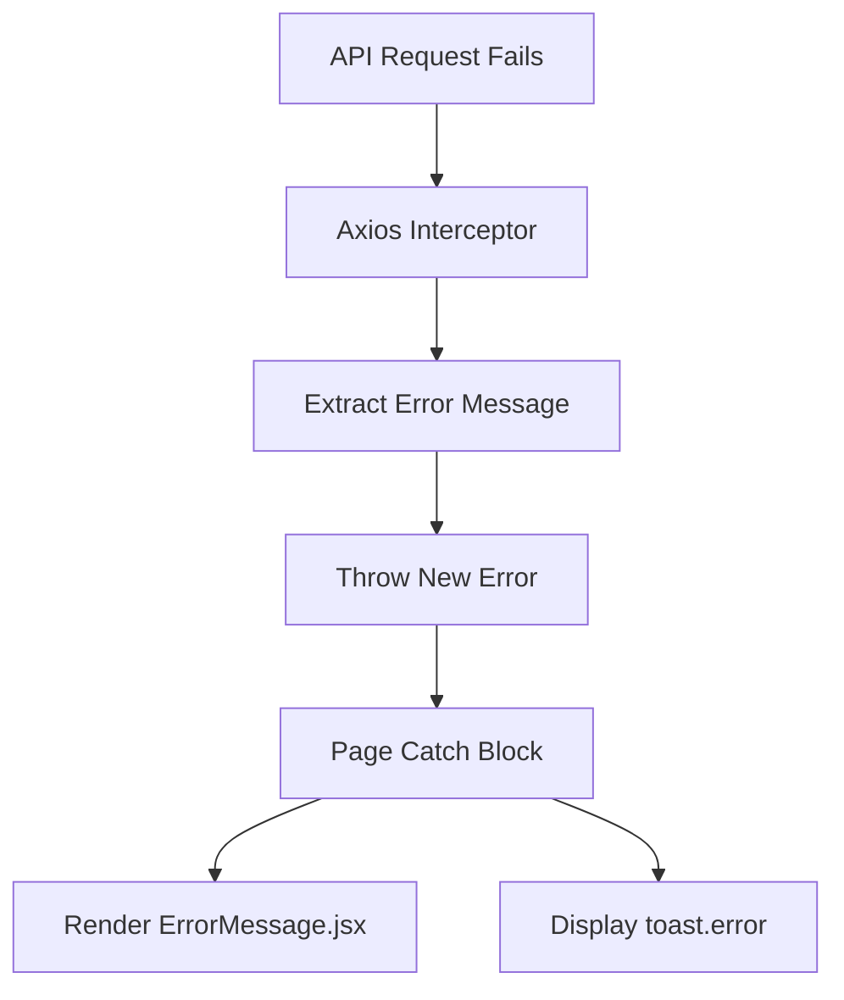
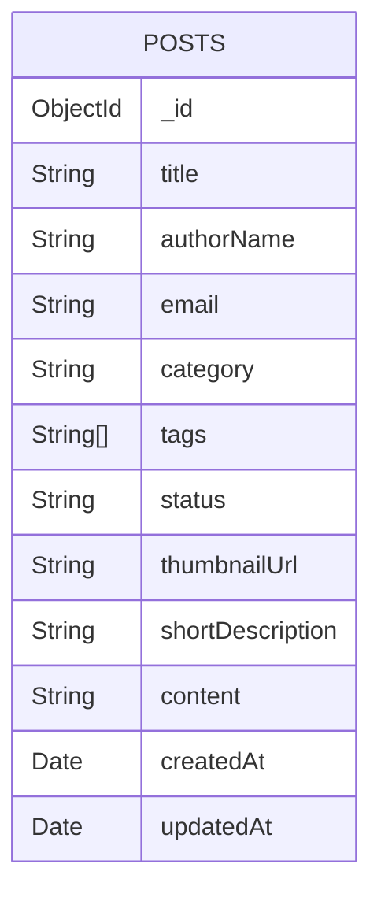
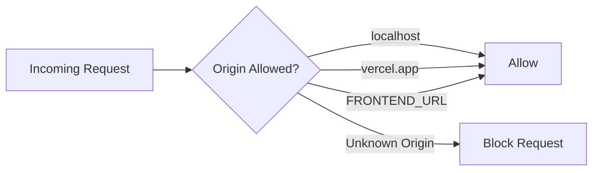

# BlogR — System Architecture

## Overview

BlogR is a full-stack blog management platform built on the MERN stack (MongoDB, Express, React, Node.js). The frontend and backend are deployed independently on Vercel and communicate through a RESTful JSON API.

---

# High-Level Architecture

---

# Frontend Component Architecture

---

# Data Flow

## Read Flow (GET Posts)

---

## Write Flow (Create / Update Post)

---

## Error Handling Flow

---

---

# Database Schema

## Collection: `posts`

### Field Constraints

| Field | Type | Constraints |
|---|---|---|
| title | String | Required, max 200 chars |
| authorName | String | Required |
| email | String | Required, valid email |
| category | String | Enum based |
| tags | Array[String] | Optional |
| status | String | Draft / Published |
| shortDescription | String | Required, max 300 chars |
| content | String | Required |

### Indexes

- Default `_id` index
- Compound text index on:
  - `title`
  - `authorName`
  - `category`

---

# CORS Policy

---

---

# Security Considerations

| Area | Implementation |
|---|---|
| Input Validation | express-validator |
| CORS | Explicit allowlist |
| Sensitive Data | `.env` ignored via `.gitignore` |
| Database Security | MongoDB Atlas IP restrictions |
| Error Handling | Generic production error messages |

---

# Future Improvements

| Area | Current | Future Improvement |
|---|---|---|
| Authentication | None | JWT + User Accounts |
| Image Upload | URL only | Cloudinary / S3 |
| Rich Text Editor | Plain textarea | Markdown / WYSIWYG |
| Search | MongoDB Text Index | Algolia / Meilisearch |
| Testing | None | Jest + RTL |
| Rate Limiting | None | express-rate-limit |
| Cold Starts | Present | Railway / Keep-alive |
