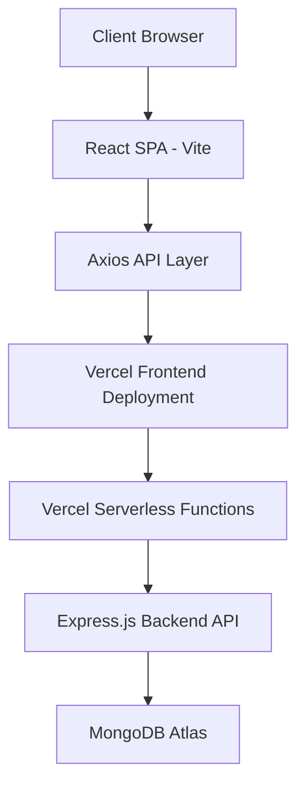
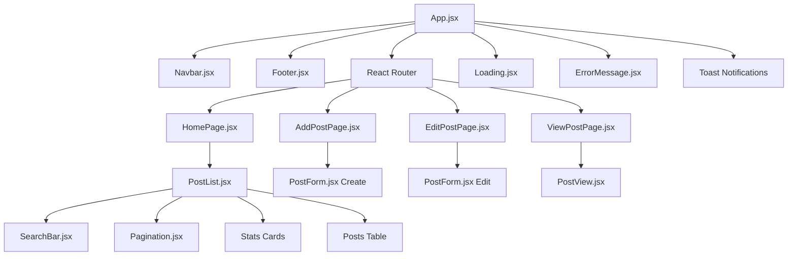
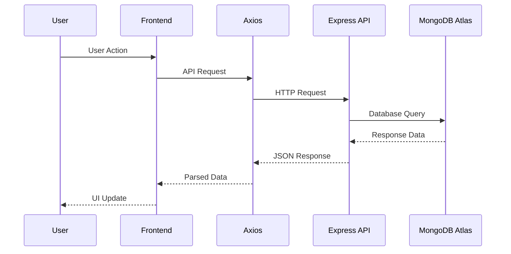
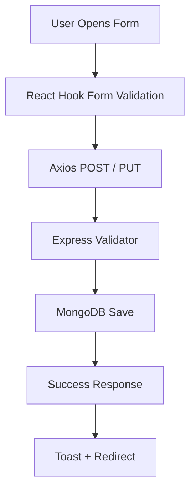
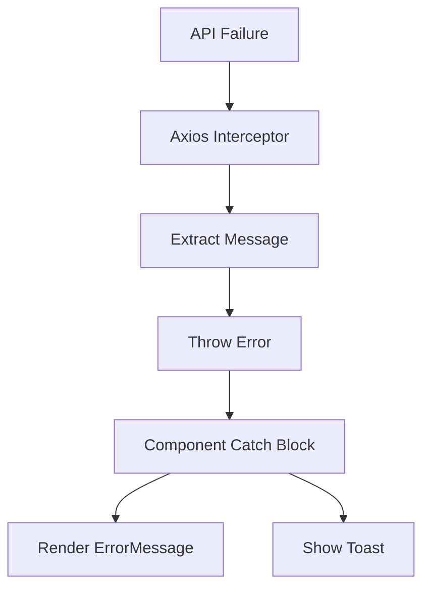
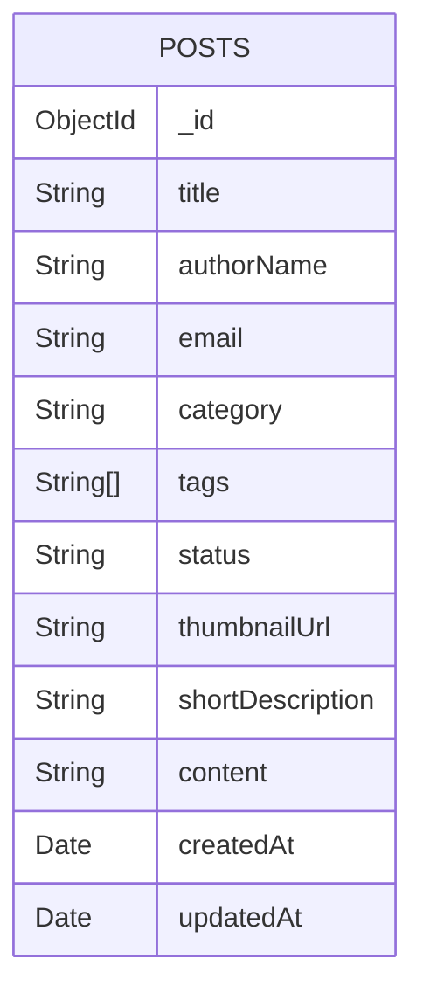
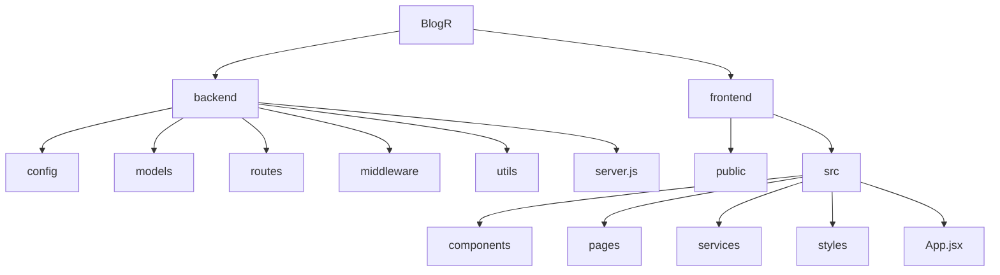
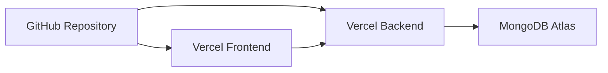
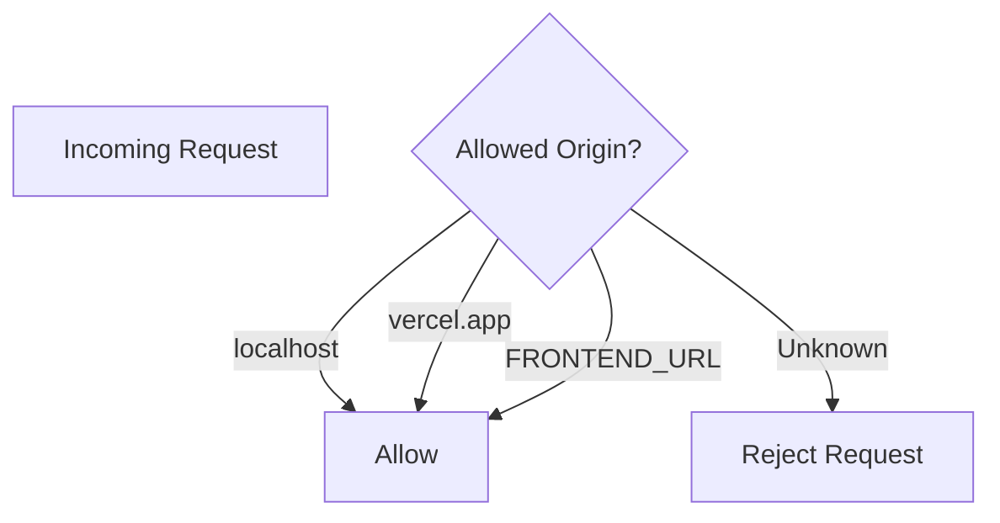

# BlogR : Blog Management System Architecture

## Project Overview

BlogR is a full-stack MERN blog management platform designed to provide a modern editorial workspace for creating, editing, managing, searching, and exporting blog posts efficiently.

The application focuses on:
- Clean and responsive user experience
- Structured content management
- Scalable REST API architecture
- Serverless cloud deployment
- Real-time filtering and search capabilities

The platform is built using:
- **Frontend:** React + Vite
- **Backend:** Node.js + Express.js
- **Database:** MongoDB Atlas
- **Deployment:** Vercel

---

## Project Goals

- Provide a centralized dashboard for blog management
- Support full CRUD operations on blog posts
- Implement scalable backend architecture
- Enable responsive and modern UI/UX
- Support filtering, searching, and CSV exporting
- Demonstrate production-ready MERN stack practices

---

## Application Entry Points

| Layer | Entry Point | Purpose |
|---|---|---|
| Frontend | `src/main.jsx` | Mounts the React application |
| Frontend App | `src/App.jsx` | Root component and routing |
| Backend | `server.js` | Initializes Express server and middleware |
| Database | `config/database.js` | MongoDB Atlas connection setup |

---

## System Architecture

---

## Frontend Architecture

---

## Backend Request Flow

---

## CRUD Flow

---

## Error Handling Flow

---

## Database Schema

---

## Project Structure

---

## Deployment Flow

---

## CORS Validation Flow

